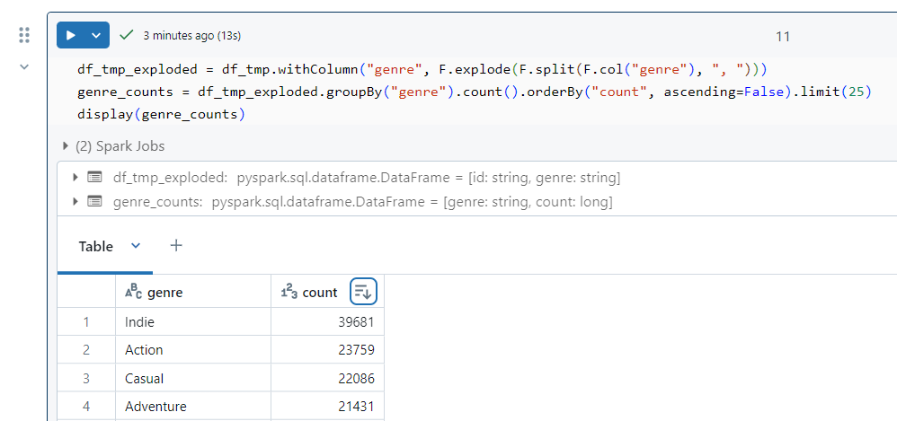

# Steam project readme

* The specs of the project are here : https://app.jedha.co/course/project-steam-ft/steam-ft

## Read the .pptx first
* Everything is in the title... We can't do it for you
* The content of the slides is mainly a cut-and-paste of what's available in the project notebook(s) and other files
* The idea is that the slides should help you understand the project and its results, guiding you step by step

## Files of the project

```
tree /f
./
│   01_steam.ipynb
│   01_steam_project.pptx
│   02_steam_part1.ipynb
│   03_steam_part2.ipynb
│   04_steam_part3.ipynb
│   readme.md
│   
└───assets
        databricks_ordered_desc.png
```

## How to use the project ?

* ``assets`` : This directory include some screen captures, backup, preliminary testing... If needed this is where the notebook read the dataset, store the log files, save some ``.json`` or ``.csv`` files...
* ``01_steam.ipynb`` : * This is a copy of the specifications 
* Again, you may want to read the ``steam_project.pptx`` to have a summary of the results and high level overview on how the project was driven
* Otherwise, based on the specs, there are 3 notebooks to consider 
    * Ideally they should be opened in Databricks
    * To get the urls of the notebooks in Databricks... Read the presentation ``steam_project.pptx``

1. ``steam_part1.ipynb`` : Analysis at the "macro" level
    1. Which publisher has released the most games on Steam?
    1. What are the best rated games?
    1. Are there years with more releases? Were there more or fewer game releases during the Covid, for example?
    1. How are the prizes distributed? Are there many games with a discount?
    1. What are the most represented languages?
    1. Are there many games prohibited for children under 16/18?

2. ``steam_part2.ipynb`` : Genres analysis
    1. What are the most represented genres?
    1. Are there any genres that have a better positive/negative review ratio?
    1. Do some publishers have favorite genres?
    1. What are the most lucrative genres?

3. ``steam_part3.ipynb`` : Platform analysis
    1. Are most games available on Windows/Mac/Linux instead?
    1. Do certain genres tend to be preferentially available on certain platforms?
    1. <span style="color:orange"><b>BONUS</b></span> - Is there any publisher dedicated to one platform ?

### Note
* Most of the <span style="color:orange"><b>Comments </b></span> cells of the notebooks are NOT about the code but about the results, the data and ideas we want to share etc.

### Note 
* While on Databricks, once a table is on screen, feel free to use the "ordering arrow" at the top of any numerical column in order to display the data in the order that you wish.

See below an example :

<p align="center">

<p>

