# Configure NVDIA performance counters

<p align="center">
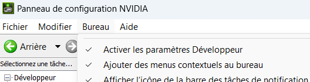
<p>

<p align="center">

<p>

# Install Powershell (<> Windows Powershell)

* https://learn.microsoft.com/en-us/powershell/scripting/install/installing-powershell-on-windows?view=powershell-7.4
* Open a Windows Powershell terminal

``winget install --id Microsoft.PowerShell --source winget``

* Close the Windows Powershell terminal
* Open a Powershell terminal 


# Install WSL

 * https://learn.microsoft.com/en-us/windows/wsl/install

```
wsl --install
wsl -l -v       # to check what is running
```

<p align="center">
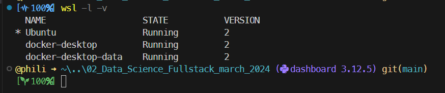
<p>

* You may want to uninstall Unbuntu and start a fresh installation 
    * Yes you can have multiple instances of Ubuntu but this is not the point here

``wsl --unregister Ubuntu``

<p align="center">
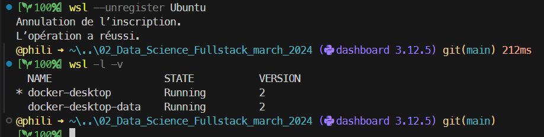
<p>


# Install VSCode WSL Extension

* Open a Powershell terminal
* Launch VSCode
* Look for and install WSL Extension
* Leave VSCode

<p align="center">
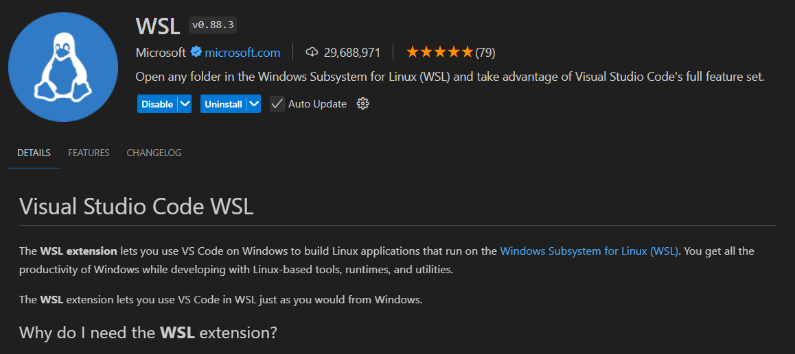
<p>

* From the command line one could use :
```
code --list-extensions
code --install-extension ms-vscode-remote.remote-wsl
# code --uninstall-extension ms-vscode.csharp
```


# Install Ubuntu

```
wsl --install -d Ubuntu
```

<p align="center">
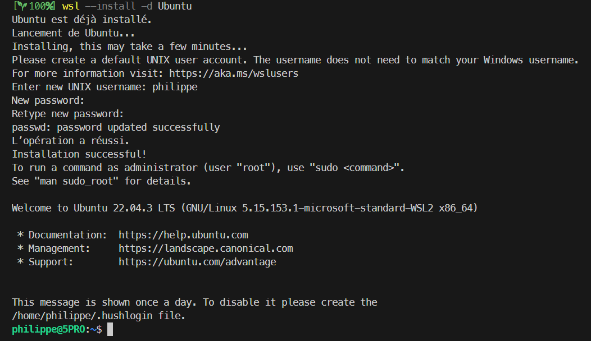
<p>

* Double check the prompt ending with `$`
* Leave the session (`exit`)


## Test Ubuntu

* Restart a session and leave it


```
wsl -d Ubuntu
exit
```

<p align="center">
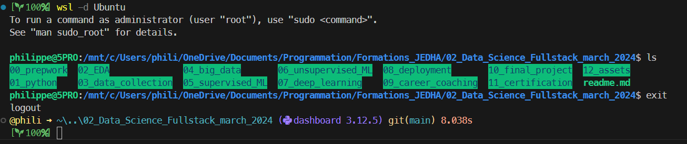
<p>


# Install CUDA under Unbuntu

* Start a session

```
wsl -d Ubuntu
sudo apt update && sudo apt upgrade
sudo apt install gcc --fix-missing
sudo apt install nvidia-cuda-toolkit
```
<p align="center">
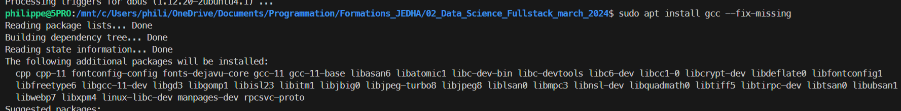
<p>


## Testing

```
nvidia-smi
```
<p align="center">
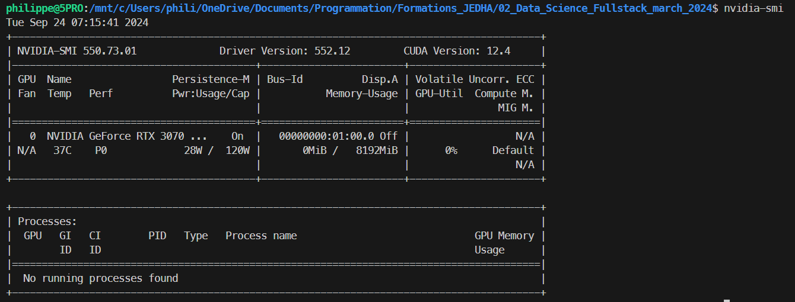
<p>


```
nvcc -V
```
<p align="center">
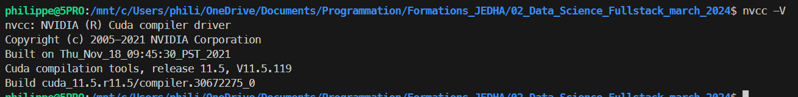
<p>


# Sample code

<p align="center">
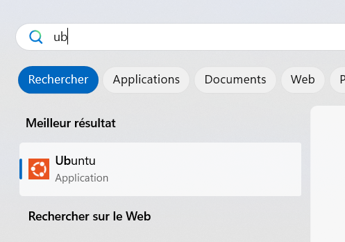
<p>

```
cd /mnt/c/Users/phili/OneDrive/Documents/Programmation/Formations_JEDHA/02_Data_Science_Fullstack_march_2024H 

code .

```


<p align="center">
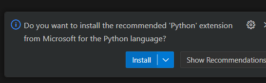
<p>


```
print("Hello")
```

<p align="center">
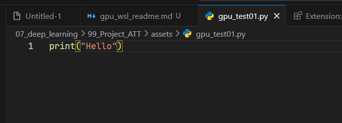
<p>


<p align="center">
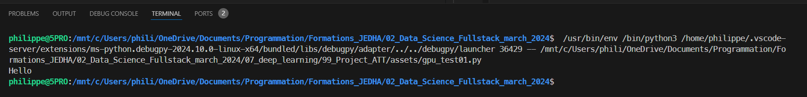
<p>

```
sudo apt install python3-pip
```


```
pip install torch
```

<p align="center">
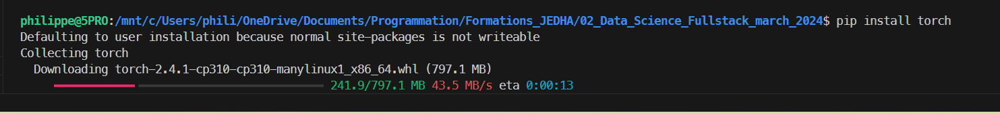
<p>


```python
import torch

if torch.cuda.is_available():
    device = torch.device("cuda")
else:    
    device = torch.device("cpu")

print(f"Using device : {device}")
```

<p align="center">
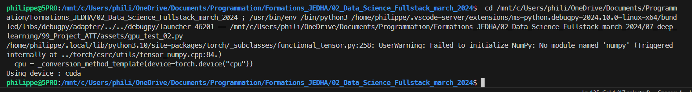
<p>

```
pip install numpy==1.26.4
pip install scipy==1.14.1
pip install scikit-learn==1.3.1
```


# Run Bert
Open 03_bert_01.ipynb
Let VSCode install Jupyter extension
pip install tensorflow==2.17.0
pip install pandas, matplotlib, tensorflow, transformers, tf_keras, scikit-learn