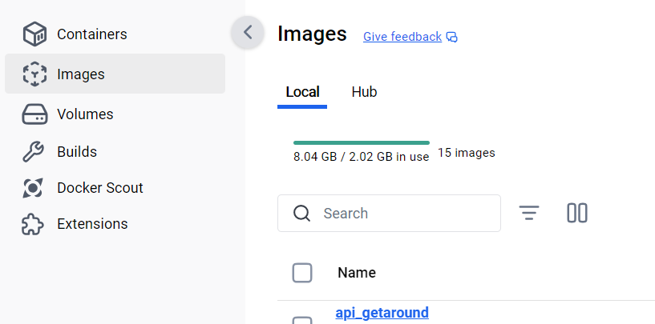

## Note :
* If necessary, double-click on the screenshots below to enlarge them.

# Local test (WIN11)

* In your Python environment you may have to install 
    * uvicorn
    * fastapi 

* From VSCode, open a terminal in the ``API`` directory
    * Make sure the terminal is open in the ``API`` directory
    * In VSCode, in the `Primary side bar` (left hand side most of the time), in the tree, right click on ``API`` then select `Open in integrated terminal` option
* Type in : `python .\api_getaround.py`
* Use a web browser and open `http://localhost:8000`

* Read the instructions and copy the string : ["Citroën","140411","100","diesel","black","convertible",true,true,false,false,true,true,true]
* Now, point your browser to `http://localhost:8000/docs`
* To make a first test : 
    * select "string" 
    * paste ["Citroën","140411","100","diesel","black","convertible",true,true,false,false,true,true,true]
    * Yes, finally, you have double square brakets at the begining and at the end of the parameters list
    * Click "Execute"
* The prediction should be close to : 114 €

* Send anything and you will get an exception

* Now, open a new terminal (CTRL + SHIFT + ù)
    * Send a request : ``curl -i -H "Content-Type: application/json" -X POST -d '{"input": [["Citroën","140411","100","diesel","black","convertible",true,true,false,false,true,true,true]]}' localhost:8000/predict``
    * Make sure to write <b>true & false</b> and NOT <b>True & False</b>

* Return to the terminal from which you launched the application
    * CTRL + C to stop the application

# Docker : local test (WIN11)

* Make sure Docker is up and running (I always forget this step...)
* From VSCode, open a terminal in the ``API`` directory
    * Make sure the terminal is open in the ``API`` directory
    * In VSCode, in the `Primary side bar` (left hand side most of the time), in the tree, right click on ``API`` then select `Open in integrated terminal` option
* Type in : `./build_api_getaround.ps1`
* At the end``api_gataround`` should be available in Docker
* TO check it you can either :
    * Type in : ``docker image ls``
    * Check in Docker

* Type in : ``docker run --rm -p 8000:8000 api_getaround``
* Point your favorite web browser to : `http://localhost:8000/docs`
* You can then make the same test as before (see **Local test (WIN11)**)

* Again you can request a prediction with :
    * ``curl -i -H "Content-Type: application/json" -X POST -d '{"input": [["Citroën","140411","100","diesel","black","convertible",true,true,false,false,true,true,true]]}' localhost:8000/predict``
    * ``curl -i -H "Content-Type: application/json" -X POST -d '{"input": [["Citroën","140411","100","diesel","black","convertible",true,true,false,false,true,true,true]]}' 127.0.0.1:8000/predict``
    * Check `C:\Windows\System32\drivers\etc\hosts` to understand why both url works

* Stop the container
    * Open an new terminal (CTRL+SHIFT+ù)
    * ``docker ps``
    * `docker stop quizzical_tu`
    * ``docker ps``

# Deployment on Heroku
* Make sure Heroku CLI is installed
    * https://devcenter.heroku.com/articles/heroku-cli
* From VSCode, open a terminal in the ``API`` directory
    * Make sure the terminal is open in the ``API`` directory
    * In VSCode, in the `Primary side bar` (left hand side most of the time), in the tree, right click on ``API`` then select `Open in integrated terminal` option
* Check heroku : ``heroku --version``
* ``heroku login``
    * blablabla...
* ``heroku container:login``
* ``heroku create api-getaround`` Please note that here we use a “-” and NOT a “_” (the latter is not allowed by Heroku ). 
* ``heroku stack:set container -a api-getaround``
* ``heroku container:push web -a api-getaround`` (this may take a while...)
* ``heroku container:release web -a api-getaround``
* You can then test the API online
    * Point your browser to https://api-getaround-4ece015745ea.herokuapp.com/
    * Read the doc and copy the string : `["Citroën","140411","100","diesel","black","convertible",true,true,false,false,true,true,true]]`

* Run a few tests using the string you have just copied

* From a new terminal (CTRL+SHIFT+ù), get a prediction using curl

