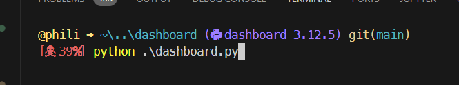
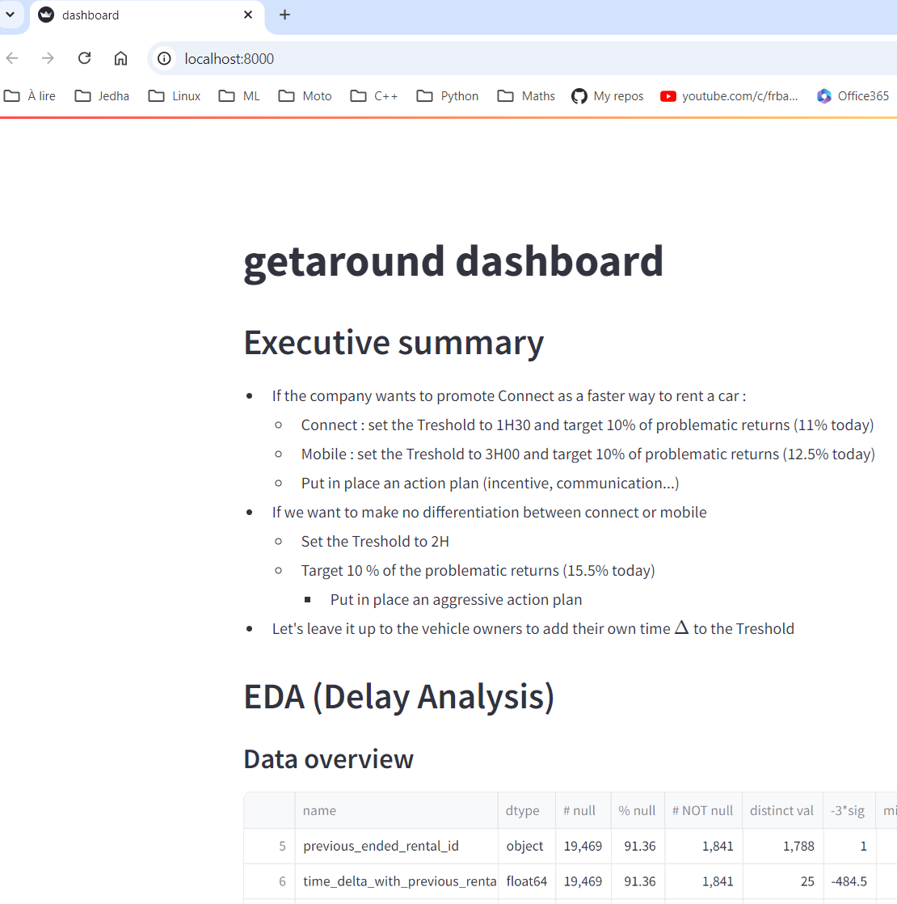
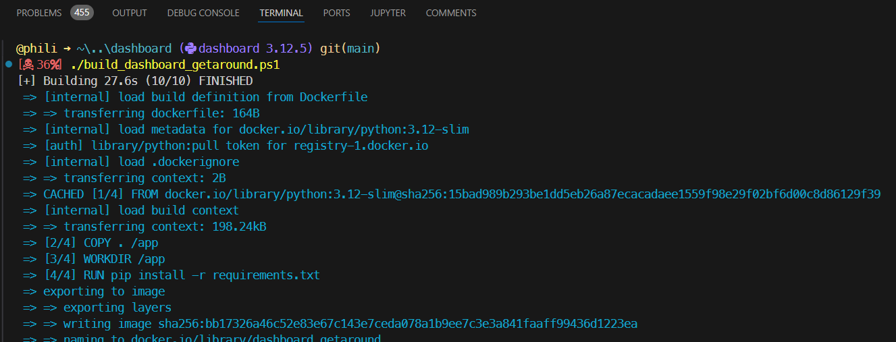
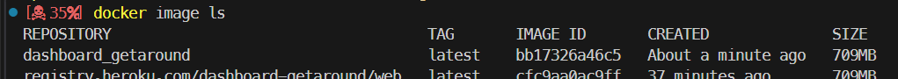
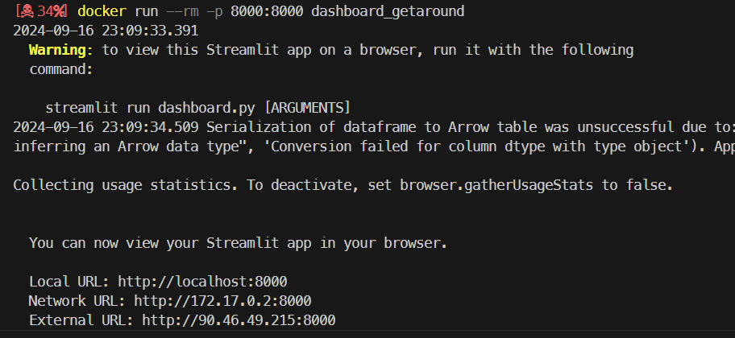
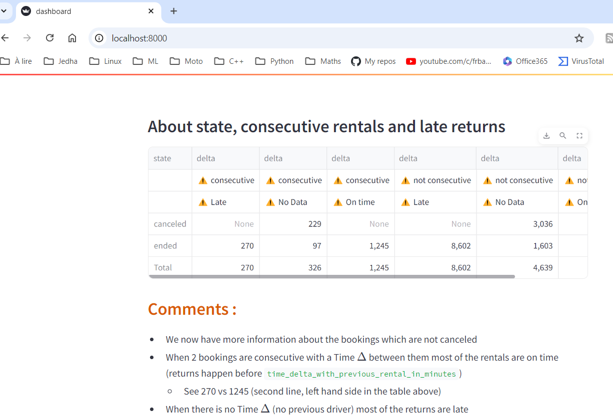
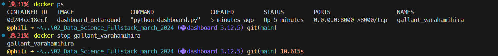
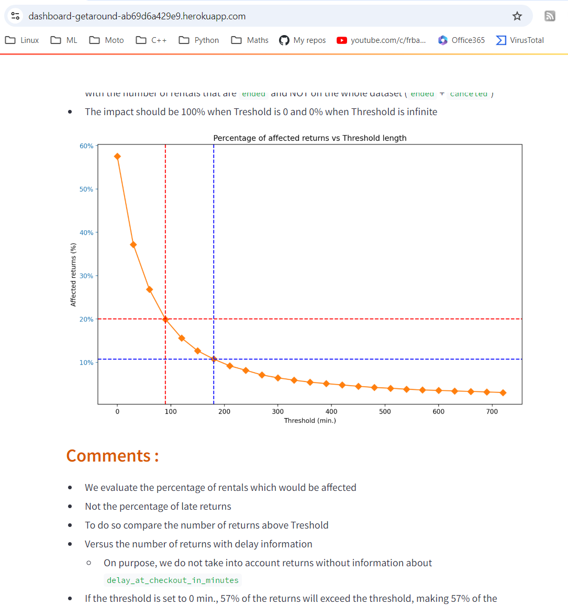

## Note :
* If necessary, double-click on the screenshots below to enlarge them.

# Local test (WIN11)

* In your Python environment you may have to install 
    * streamlit

* From VSCode, open a terminal in the ``dashboard`` directory
    * Make sure the terminal is open in the ``dashboard`` directory
    * In VSCode, in the `Primary side bar` (left hand side most of the time), in the tree, right click on ``dashboard`` then select `Open in integrated terminal` option
* Type in : `python .\dashboard.py`

* Use a web browser and open `http://localhost:8000`

* Close the tab in the browser
* In the terminal type in ``CTRL + C``

# Docker : local test (WIN11)
* Make sure Docker is up and running (I always forget this step...)
* From VSCode, open a terminal in the ``dasboard`` directory
    * Make sure the terminal is open in the ``dasboard`` directory
    * In VSCode, in the `Primary side bar` (left hand side most of the time), in the tree, right click on ``dashboard`` then select `Open in integrated terminal` option
* Type in : `./build_dashboard_getaround.ps1` (just type in ``./build`` then strike ``TAB``, Powershell is your friend)

* At the end``dashboard_getaround`` should be available in Docker
* TO check it you can either :
    * Type in : ``docker image ls``
    * Check in Docker

* Type in : ``docker run --rm -p 8000:8000 dashboard_getaround``

* Point your favorite web browser to : `http://localhost:8000`

* Close the tab in the browser 
* Stop the container
    * Open an new terminal (CTRL+SHIFT+ù)
    * ``docker ps``
    * `docker stop quizzical_tu`
    * ``docker ps``

# Deployment on Heroku
* Make sure Heroku CLI is installed
    * https://devcenter.heroku.com/articles/heroku-cli
* From VSCode, open a terminal in the ``API`` directory
    * Make sure the terminal is open in the ``API`` directory
    * In VSCode, in the `Primary side bar` (left hand side most of the time), in the tree, right click on ``API`` then select `Open in integrated terminal` option
* Check heroku : ``heroku --version``
* ``heroku login``
    * blablabla...
* ``heroku container:login``
* ``heroku create dashboard-getaround`` Please note that here we use a “-” and NOT a “_” (the latter is not allowed by Heroku ). 
* ``heroku stack:set container -a dashboard-getaround``
* ``heroku container:push web -a dashboard-getaround`` (this may take a while...)
* ``heroku container:release web -a dashboard-getaround``

Once the first deployment on Heroku has been done. If you need to update the image on the server you can simply use :
* ``./deploy_dashboard_getaround.ps1`` (type in ``./de`` then strike TAB)

* Point your favorite web browser to : `https://dashboard-getaround-ab69d6a429e9.herokuapp.com/` (your URL will be different)

